# Alta Clara

[](https://github.com/WeslleySoaress/alta-clara/actions/workflows/ci.yml)

Orientação e acompanhamento da alta hospitalar, do hospital até a casa do paciente.

A equipe monta o plano de alta num formulário, outra pessoa da equipe revisa e
publica, e o paciente recebe um QR code que abre um plano claro: **o que fazer
hoje**, os remédios na hora certa, os cuidados em casa, os retornos e **quando
procurar ajuda**. Um cuidador autorizado acompanha com a própria conta. Quando
algo não foi entendido, vira uma pendência para a equipe.

> **Projeto de portfólio com dados exclusivamente fictícios.** Não foi validado
> para uso clínico e não deve receber dados reais de saúde.

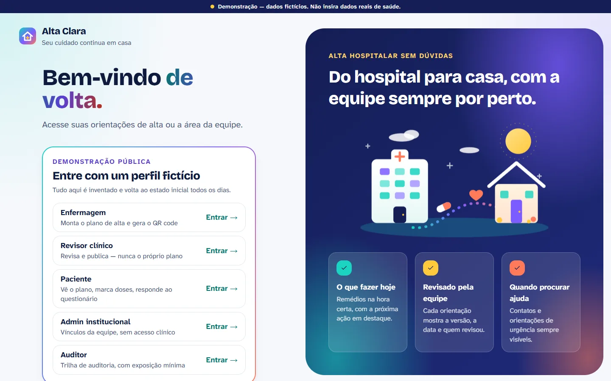

## Índice

- [O que a plataforma faz](#o-que-a-plataforma-faz)
- [Telas](#telas)
- [Demonstração online](#demonstração-online)
- [Stack](#stack)
- [Como rodar](#como-rodar)
- [Testes](#testes)
- [Segurança](#segurança)
- [Documentação](#documentação)
- [Limitações conhecidas](#limitações-conhecidas)
- [Autor](#autor)
- [Licença](#licença)

## O que a plataforma faz

**O caminho de uma alta, do começo ao fim:**

1. A enfermagem cria o plano a partir de um **modelo institucional** e preenche remédios, horários, cuidados, sinais de alerta e retornos.
2. Envia para **revisão**. Quem escreveu ou editou o plano **não pode aprová-lo**: a separação de funções é regra do servidor, não da tela.
3. O revisor confere a prévia exatamente como o paciente vai ver, **digita o prontuário** (contra publicar no paciente errado) e publica uma **versão**.
4. A equipe gera o **QR code de ativação**. Ele sozinho não abre nada: o paciente confirma um código enviado ao contato registrado no atendimento.
5. O paciente vê **o que fazer hoje**, marca as doses, ouve o plano em voz alta, aumenta a letra, imprime ou adiciona os horários ao calendário.
6. Responde a uma **confirmação de entendimento** gerada do próprio plano. Errar ou responder "não sei" abre uma pendência para a equipe reforçar a orientação.
7. Se o plano muda, o paciente vê **"o que mudou na minha alta"**: antes e depois, quem revisou e o motivo.

**Além do fluxo principal:**

- **Círculo de cuidado:** o paciente convida um cuidador com escopo e validade, e revoga na hora
- **Remédio "se necessário"** com intervalo mínimo e máximo por dia, conferidos no servidor com trava contra registros simultâneos
- **Lembretes no servidor** com fuso horário, idempotência e cancelamento automático quando sai uma versão nova
- **Pendências após a alta:** retorno sem data, dúvida sobre dose, dificuldade para obter remédio, orientação a reforçar
- **Diário de doses** relatadas, para a equipe acompanhar a adesão
- **Administração e auditoria:** vínculos da equipe por instituição e trilha de auditoria com exposição mínima
- **HL7 FHIR R4:** exportação de exemplo do plano (sandbox, sem conexão com prontuário)
- **IA opcional para a equipe:** sugere linguagem mais simples, com verificação determinística de números, unidades e negações, e revisão humana obrigatória (desligada por padrão)
- **Duas instituições fictícias** isoladas entre si: nenhuma regra deixa a equipe de uma ver dados da outra

**O que a plataforma _não_ faz:** prescrição, triagem, diagnóstico ou integração
real com prontuário eletrônico. Os textos de orientação vêm da equipe, nunca do
sistema.

## Telas

<table>
<tr>
<td width="50%">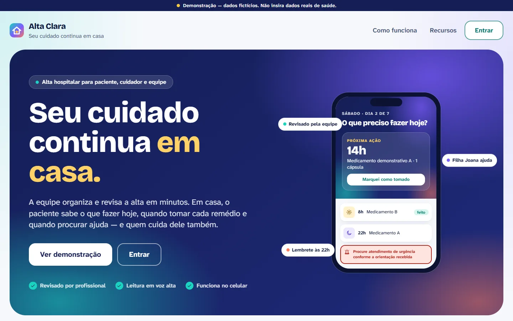</td>
<td width="50%">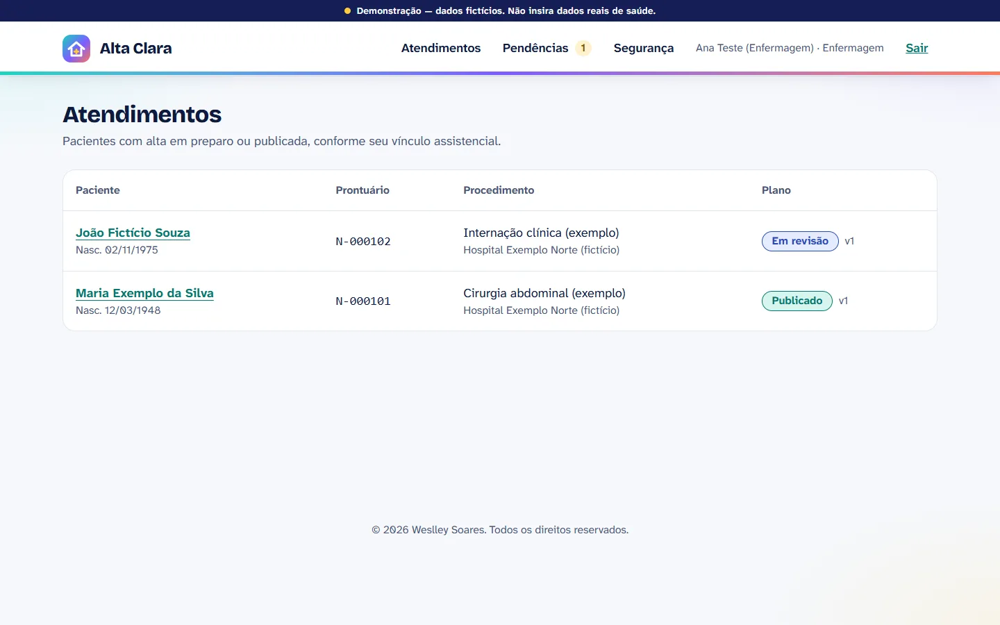</td>
</tr>
<tr>
<td><b>Início</b> — o problema e a proposta, com a prévia do plano no celular</td>
<td><b>Atendimentos</b> — a situação de cada plano para a enfermagem</td>
</tr>
<tr>
<td>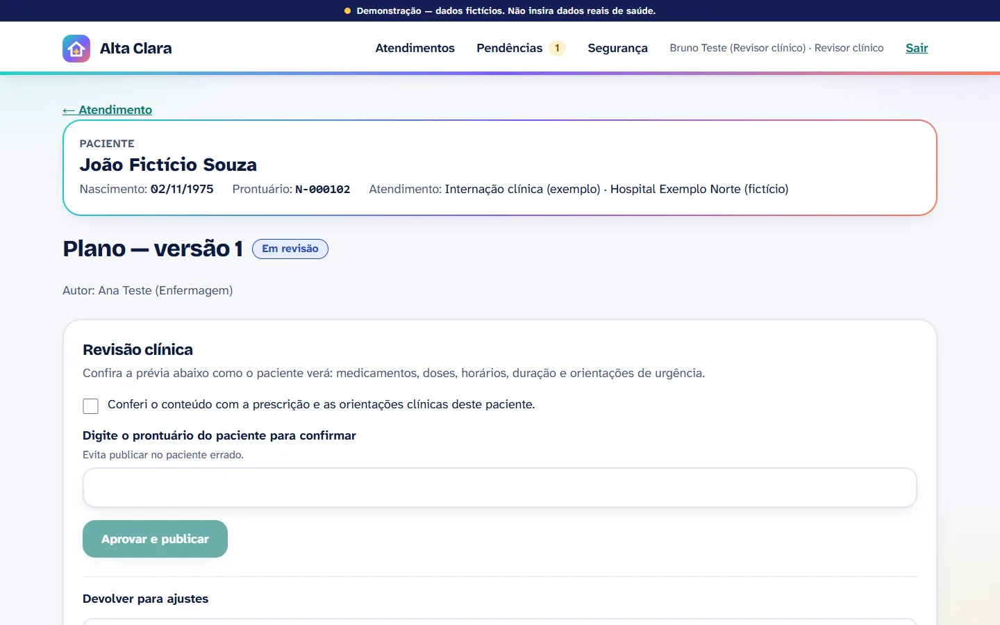</td>
<td>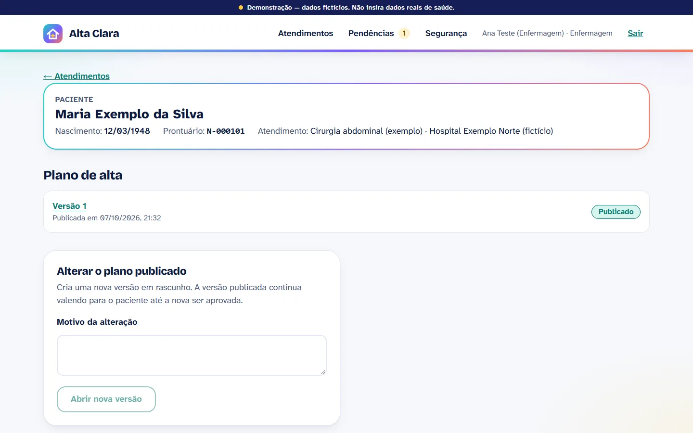</td>
</tr>
<tr>
<td><b>Revisão</b> — conferência, prontuário digitado e a prévia como o paciente verá</td>
<td><b>Plano publicado</b> — versões, nova versão com motivo e o QR code de ativação</td>
</tr>
<tr>
<td>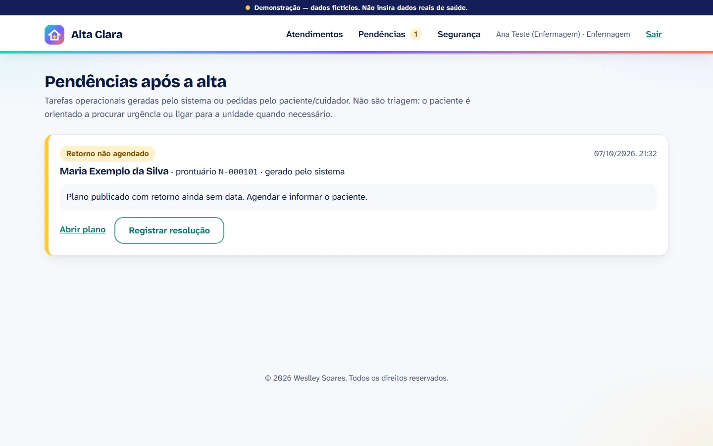</td>
<td>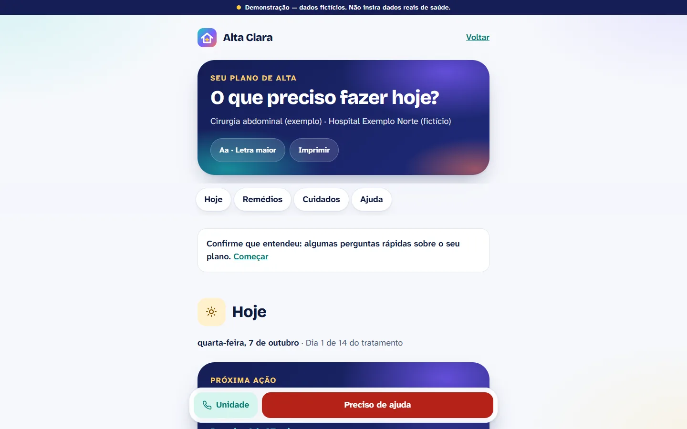</td>
</tr>
<tr>
<td><b>Pendências</b> — o que o sistema ou o paciente sinalizou, por tipo</td>
<td><b>Paciente</b> — o que fazer hoje, com a próxima ação em destaque</td>
</tr>
<tr>
<td>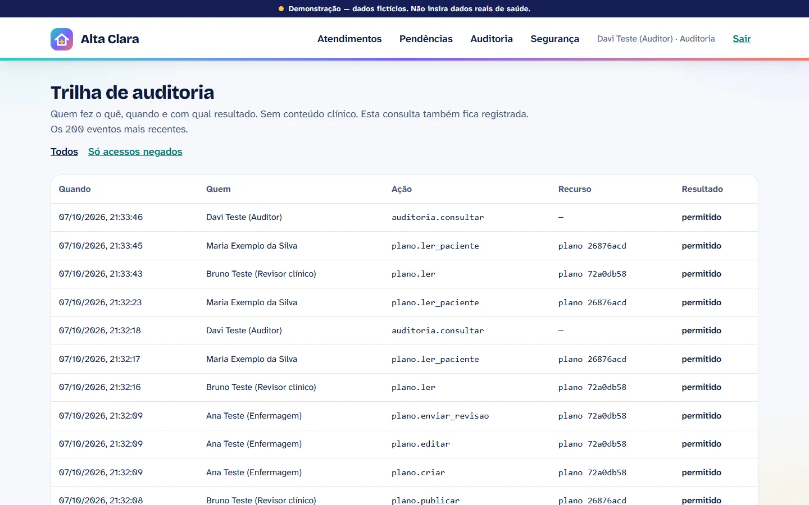</td>
<td>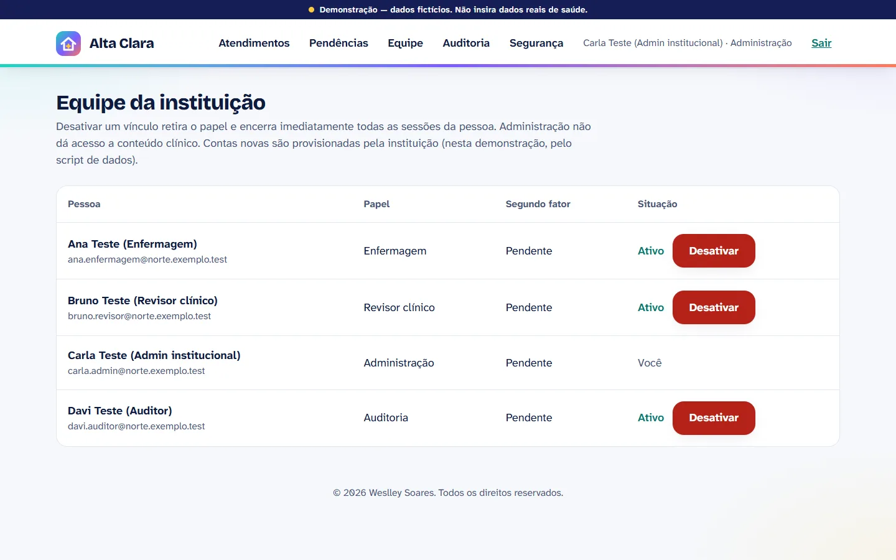</td>
</tr>
<tr>
<td><b>Auditoria</b> — quem fez o quê, sem conteúdo clínico</td>
<td><b>Administração</b> — vínculos da equipe, sem acesso a dados de pacientes</td>
</tr>
</table>

### No celular

<table>
<tr>
<td width="25%">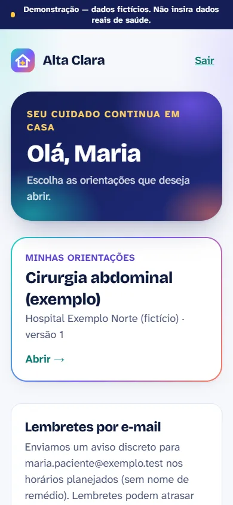</td>
<td width="25%">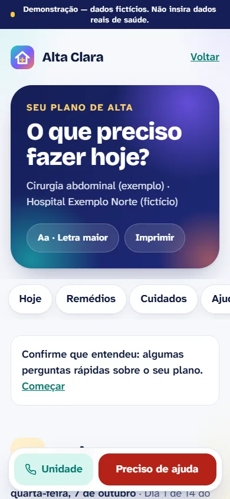</td>
<td width="25%">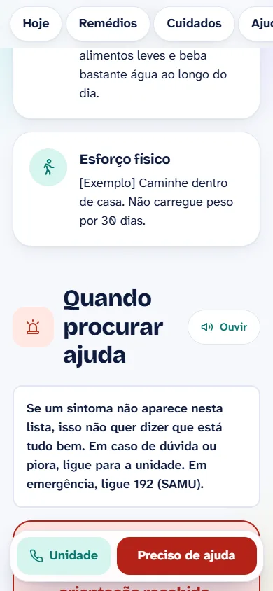</td>
<td width="25%"></td>
</tr>
<tr>
<td><b>Minhas orientações</b></td>
<td><b>Hoje</b> — com o botão de ajuda sempre à mão</td>
<td><b>Quando procurar ajuda</b> — três grupos, sem "normal" em verde</td>
<td><b>Demonstração</b> — sem conta</td>
</tr>
</table>

### O detalhe que organiza a interface

O público do plano é, muitas vezes, uma pessoa idosa, cansada, recém-saída de uma
internação. Por isso a tela do paciente responde a **uma pergunta só, "o que preciso
fazer hoje?"**, com a próxima ação em destaque e o resto abaixo. A fonte é a
**Atkinson Hyperlegible**, desenhada para baixa visão; todo par de cores passa no
contraste WCAG AA (30 pares conferidos por script); os sinais de alerta são
separados em três grupos e **nenhum aparece em verde como "normal"**, porque o
sistema não sabe o que é normal para aquela pessoa.

## Demonstração online

A demonstração pública roda em modo próprio (`ALTA_MODO_DEMONSTRACAO=1`): a tela de
entrada tem **um botão por perfil** — enfermagem, revisor, paciente, admin e
auditor —, os dados são fictícios e voltam ao estado inicial todos os dias, e nada
que tire a conta compartilhada de outro visitante é permitido (trocar senha,
ligar 2FA, encerrar sessões). O que mudar nesse modo está em
[`src/server/demonstracao.ts`](src/server/demonstracao.ts).

## Stack

| Camada | Tecnologia |
| ------ | ---------- |
| Aplicação | Next.js 16 (App Router), React 19, TypeScript estrito |
| Dados | PostgreSQL 18, Drizzle ORM, migrações versionadas, dois papéis de banco (dono e aplicação) |
| Autenticação | Better Auth: Argon2id, TOTP, passkeys (WebAuthn), sessões no servidor |
| Interface | Tailwind CSS 4, tokens de cor conferidos por contraste |
| Validação | Zod 4 em toda entrada e todo conteúdo de plano |
| Integrações | HL7 FHIR R4 (sandbox), Claude API (opcional, desligada por padrão) |
| Testes | Vitest, Chrome real via playwright-core, axe-core, DAST próprio |

```
drizzle/       migrações SQL versionadas
scripts/       banco local, seed, backup cifrado, E2E, DAST, capturas, contraste
src/
  app/         rotas: equipe, paciente, ativar, conta, entrar, demo
  components/  interface reutilizável e a visão do plano
  lib/         regras puras: agenda, fuso, datas, remédio "se necessário"
  server/      autenticação, autorização por objeto, domínio, integrações
tests/         domínio, autorização e banco
docs/          documentação detalhada e evidências dos testes
```

**Por que dois arquivos de ambiente:** o processo web recebe só o usuário
`alta_app`, que não cria tabelas e só *insere* na auditoria. A URL do dono do
esquema, a senha do superusuário e a chave dos backups ficam em
`.env.operacao.local`, lido apenas por migrações, seed e backup — e a aplicação se
recusa a subir em produção se receber qualquer um deles.

## Como rodar

**Requisitos:** Node.js 22 e npm 10+. Nenhum Docker: o PostgreSQL local vem do
pacote `embedded-postgres`.

```bash
npm install
npm run setup        # gera .env.local (app) e .env.operacao.local (banco), com segredos aleatórios
npm run db           # PostgreSQL local em :5433 — deixe este terminal aberto
```

Em outro terminal:

```bash
npm run db:migrate   # tabelas e privilégios mínimos
npm run db:seed      # dados fictícios; as senhas vão para .dev-credenciais.md
npm run dev -- --port 3100
```

Abra <http://localhost:3100>.

- **Profissionais** configuram o segundo fator (aplicativo autenticador) no primeiro acesso.
- **Pacientes** são ativados pelo QR code gerado na área da equipe.
- **Mensagens** (códigos, convites, lembretes) ficam em <http://localhost:3100/dev/mensagens> — nada sai da máquina.
- **Demonstração sem conta:** <http://localhost:3100/demo>.

Para o modo de demonstração pública, com um botão por perfil:

```bash
ALTA_DEMO_SENHA="uma frase longa qualquer" npm run db:seed -- --reset --demo
npm run build
ALTA_MODO_DEMONSTRACAO=1 ALTA_DEMO_SENHA="uma frase longa qualquer" npm start
```

## Testes

```bash
npm run typecheck && npm run lint && npm run build
npm test                      # domínio, autorização e banco
npm run test:e2e              # Chrome real: fluxo completo, passkey, acessibilidade
npm run test:dast             # DAST local contra o servidor (DAST_URL)
npm run audit:deps            # vulnerabilidades altas/críticas em dependências de produção
npm run check:sast            # eslint-plugin-security
npm run check:segredos        # secretlint
npm run check:contraste       # contraste WCAG AA de todos os pares de cor
```

| Verificação | Resultado |
| ----------- | --------- |
| `typecheck` · `lint` · `build` | sem erros |
| `npm test` | **105 testes**, 5 arquivos, contra PostgreSQL real |
| `npm run test:e2e` | **28 verificações** no Chrome, incluindo axe-core em 8 telas |
| `npm run test:dast` | **29 verificações** contra o build de produção |
| `npm run check:contraste` | **30/30 pares** acima do WCAG AA |
| `npm run check:segredos` | **0 achados** |

Tudo isso roda no GitHub Actions a cada push, em quatro jobs paralelos — inclusive
o E2E no Chrome e o DAST contra o build de produção, com um PostgreSQL 18 de
verdade ([`.github/workflows/ci.yml`](.github/workflows/ci.yml)). O selo no topo
reflete a última execução.

Os testes cobrem o que quebra regra clínica ou segurança: paciente A tentando ler,
listar, registrar ou exportar dados de B; instituição A contra B; cuidador
revogado; convite expirado, reutilizado e consumido em paralelo; dois
processadores de lembrete ao mesmo tempo; virada de dia no fuso de Brasília; e o
revisor tentando aprovar um plano que ele mesmo editou.

**Os testes acharam defeitos reais**, e o mais instrutivo foi este: ao publicar uma
versão nova do plano, as doses que o paciente já tinha marcado no dia "sumiam",
porque os registros estavam presos à versão. Na tela, isso convidaria a tomar a
dose de novo. A correção fez os registros valerem para o atendimento inteiro. A
lista completa, rodada por rodada, está em
[docs/relatorio-testes.md](docs/relatorio-testes.md).

## Segurança

[docs/seguranca.md](docs/seguranca.md) mapeia as ameaças e aponta onde cada uma é
tratada e como foi verificada. O resumo:

- **Senha** com Argon2id nos parâmetros da OWASP, mínimo de 15 caracteres (NIST SP 800-63B-4), recusa de padrões fracos mesmo longos ("p@ssw0rdp@ssw0rd") e consulta opcional ao Pwned Passwords por k-anonimato.
- **Segundo fator obrigatório para profissionais** (TOTP ou passkey); cadastrar ou remover autenticador exige login recente; "confiar neste aparelho" é recusado.
- **Sessão** no servidor, com 15 min de inatividade e 8 h de duração para profissionais, aviso antes de expirar, lista de aparelhos e encerramento individual.
- **Força bruta** limitada por IP e por conta (bloqueio progressivo, nunca permanente), igual para e-mail existente ou não.
- **Autorização por objeto** em cada serviço, com resposta 404 idêntica para "não existe" e "não é seu".
- **QR code** com token de 256 bits guardado só em hash, no fragmento da URL (não vai ao servidor nem ao log), trocado por cookie HttpOnly e consumido atomicamente.
- **CSP com nonce** e `strict-dynamic`, `no-store` nas áreas com dados pessoais (inclusive no prefetch), cabeçalhos de isolamento e nenhum dado clínico em logs ou notificações.
- **Backup cifrado** com AES-256-GCM e restauração conferida em banco separado.

Tudo isso foi testado **contra instalações locais e de CI, com dados fictícios**.
Nenhum sistema de terceiro foi testado. Um relatório sem achados não comprova a
ausência de vulnerabilidades.

## Documentação

| Documento | O que traz |
| --------- | ---------- |
| [Decisões](docs/decisoes.md) | Escolhas técnicas e de produto, com o porquê de cada uma |
| [Arquitetura](docs/arquitetura.md) | Camadas, modelo de dados e fluxos |
| [Permissões](docs/permissoes.md) | A matriz de perfis e o que cada um pode fazer |
| [Segurança](docs/seguranca.md) | Ameaças, controles e como cada um foi verificado |
| [Relatório de testes](docs/relatorio-testes.md) | O que foi executado, os resultados e os defeitos encontrados |
| [Pesquisa](docs/pesquisa.md) | Referências internacionais e concorrentes |
| [Roteiro de demonstração](docs/roteiro-demo.md) | A apresentação em 3 minutos |
| [Implantação](docs/implantacao.md) | Publicação, backups e próximos passos |

## Limitações conhecidas

Coisas que a plataforma **não** faz, e que são decisão consciente, não esquecimento:

- **Não há provedor real de e-mail ou SMS.** As mensagens vão para uma caixa local (ou a caixa simulada da demonstração). Em produção, o envio falha de propósito até um provedor ser configurado e avaliado.
- **A chamada real à IA nunca foi executada.** O fluxo é testado com modelo simulado, incluindo tentativa de injeção de instrução; sem credencial, o recurso fica desligado. A verificação ainda não pega instruções novas que não contenham números.
- **O FHIR não foi validado** por validador oficial nem conectado a um servidor ou prontuário.
- **Leitor de tela e passkey em aparelho físico não foram testados por pessoas.** O axe-core não acusa violações em 8 telas e a passkey foi testada com autenticador WebAuthn virtual.
- **Sem SSO institucional (OIDC)** — por isso o botão não aparece.
- **O dono do esquema ainda pode alterar a auditoria.** O usuário da aplicação não pode, mas o log não é imutável de verdade.
- **Nada aqui declara conformidade legal** (LGPD, regulação de software em saúde). Uso real exigiria avaliação jurídica, clínica e de segurança por terceiros.

## Autor

**Weslley Soares** — [@WeslleySoaress](https://github.com/WeslleySoaress)

## Licença

**© 2026 Weslley Soares. Todos os direitos reservados.** O código está publicado
apenas para consulta e avaliação como portfólio; nenhuma licença de uso, cópia ou
distribuição é concedida. Veja [LICENSE](LICENSE).
